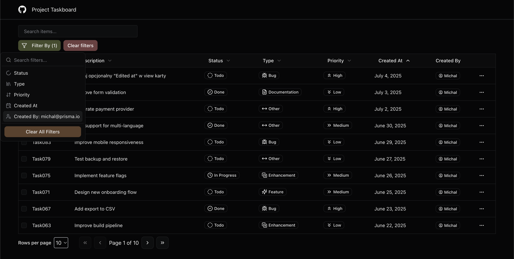

# Project Taskboard

A **CRUD application** for managing tasks. You can **create**, **read**, **update**, and **delete** tasks easily. The table supports **server-side sorting**, **filtering**, and a **search bar**, making it simple to manage tasks at scale.

## Features

✅ Create, read, update, and delete tasks\
✅ Server-side sorting\
✅ Server-side filtering\
✅ Server-side search\
✅ Filter by priority, status, created at, and more\
✅ Modern UI with smooth interactions

## Tech Stack

- **TypeScript**
- **React**
- **Next.js**
- **TanStack Table** 
- **TanStack Query** 
- **Prisma** 
- **PostgreSQL**

## Screenshots




## Getting Started

### Prerequisites

- Node.js >= 18
- PostgreSQL database

### Installation

```bash
git clone https://github.com/your-username/project-taskboard.git
cd project-taskboard
npm install
```

### Setup

1. Copy the example environment variables:

```bash
cp .env.example .env
```

2. Update the `.env` file with your database URL and other necessary configs.

3. Push Prisma schema to the database:

```bash
npx prisma db push
```

4. (Optional) Seed your database:

```bash
npx prisma db seed
```

### Running the App

```bash
npm run dev
```

Open [http://localhost:3000](http://localhost:3000) in your browser.

## Deployment

The app can be easily deployed to platforms like **Vercel**, **Netlify**, or any server that supports Node.js.

## Contributing

Contributions are welcome! Please open an issue or submit a pull request.

## License

[MIT](LICENSE)

---

**Project Taskboard — manage your tasks with powerful table features and a clean UI!**
